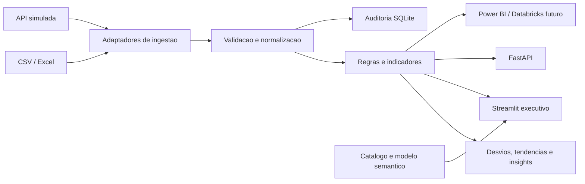

# IPNOD | Inteligencia de Producao E&P

Aplicacao demonstrativa para conectar processo operacional, dados governados, regras explicaveis e decisao executiva. O recorte usa producao semanal sintetica por ativo/poco/instalacao; nenhum dado corporativo real esta incluido.

## Arquitetura



Decisao tecnica: monolito modular local, com contrato canonico entre adaptadores e regras. O Streamlit reduz o tempo para validar a experiencia; a API FastAPI oferece um contrato separado para integracoes futuras. Pandas trata os dados, Plotly apresenta os indicadores e SQLite mantem a trilha basica de cargas.

Decisao de governanca: cada extrato e normalizado para um esquema conhecido, erros ficam visiveis e cada indicador tem definicao, responsavel e versao. Os dados de demonstracao sao sinteticos e deterministas, sem pretensao de representar uma instalacao real.

Decisao gerencial: a navegacao acompanha as perguntas de coordenacao: qual o resultado, onde esta o desvio, que sinal merece investigacao e quem responde pelo dado/indicador.

## Estrutura

```text
src/
  ingestion/       Contrato DataSource, arquivos e API simulada
  transformation/  Esquema canonico e controles de qualidade
  business/        Regras configuraveis e calculo de indicadores
  analytics/       Desvios, tendencia, insights e modelo semantico
  governance/      Catalogo e auditoria SQLite
  api/             API FastAPI
  frontend/        Aplicacao Streamlit
tests/             Testes unitarios com unittest
docs/              Diagrama semantico gerado pela aplicacao
data/              Banco local de auditoria gerado em tempo de execucao
```

## Executar no Windows

```powershell
py -3.11 -m venv .venv
.venv\Scripts\Activate.ps1
python -m pip install -r requirements.txt
python -m unittest discover -s tests -v
streamlit run src/frontend/app.py
```

A API pode ser iniciada em outro terminal:

```powershell
uvicorn src.api.main:app --reload
```

Endpoints demonstrativos: `/health`, `/production`, `/insights` e `/docs`.

## Demonstracao

1. Abra a aplicacao com a fonte `API simulada E&P` e observe a visao geral.
2. Compare o plano e o realizado; use o ranking para localizar perdas concentradas.
3. Leia os insights como hipoteses para triagem e confira a tabela de desvios.
4. Abra Governanca para inspecionar qualidade, dicionario, owners, auditoria e modelo semantico.
5. Troque para `Arquivo CSV / Excel` para demonstrar a substituicao de fonte sem alterar as regras.
6. Use Assistente para comparar ativos, rastrear definicoes, explorar associacao com indisponibilidade, priorizar validacoes e baixar um resumo executivo fundamentado.

O arquivo deve conter as colunas canonicas listadas em [DATA-CATALOG.md](DATA-CATALOG.md). A carga em Excel requer `openpyxl`.

## Limites e evolucao

- O prototipo e local e de usuario unico; SQLite nao e um repositorio corporativo concorrente.
- API, arquivos e regras demonstram contratos, nao autenticacao, SLA ou integracao com sistemas Petrobras.
- Ausencias, N/A, estimativas sem metadado e valores invalidos permanecem distintos; zero e preservado e cobertura parcial nao e apresentada como total completo.
- A tendencia usa media das variacoes semanais recentes; e explicavel e nao e previsao de reservatorio.
- Para Power BI/Databricks, substituir adaptadores e publicar uma camada curada com contratos, historico, testes, identidade e controles corporativos.
- Antes de uso operacional: validar definicoes com Operacoes, Engenharia de Producao e Planejamento; aprovar owner, qualidade minima, segregacao de acesso e processo de mudanca.

## Documentos de decisao e operacao

- [ADR.md](ADR.md): decisoes e trade-offs de arquitetura.
- [DATA-CATALOG.md](DATA-CATALOG.md): dicionario, fontes e responsabilidades.
- [BUSINESS-RULES.md](BUSINESS-RULES.md): definicoes e limiares editaveis.
- [OPERATING-MODEL.md](OPERATING-MODEL.md): processo, papeis, riscos, controles e valor.
- [PRESENTATION.md](PRESENTATION.md): roteiros para a banca e perguntas dificeis.